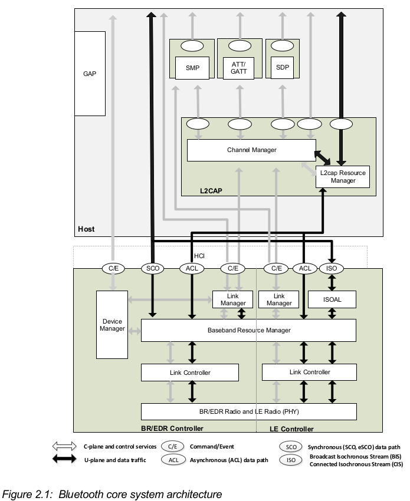
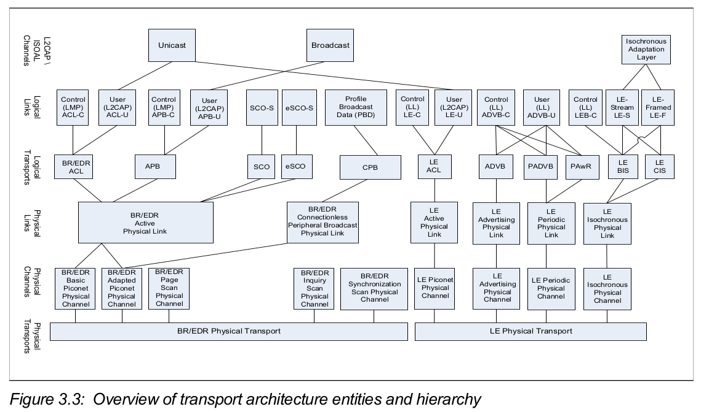

# Bluetooth Core System Architechture
ref : [Bluetooth Core Specification v5.4](https://www.bluetooth.com/specifications/specs/core-specification-5-4/)

- BR/EDR : L2CAP, SDP and GAP blocks
- LE : L2CAP, SMP, Attribute Protocol, GAP and Generic Attribute Profile (GATT) blocks
- 透過 HCI (Host Controller Interface) 溝通 host 和藍牙 controller ，為兩者提供複數界面的接口 (uart，usb ...)
- 藍牙協議可以大致分成：物理層（Physical Layer）、邏輯層（Logical Layer）、L2CAP Layer 和應用層（APP Layer）


# Host Architectural Blocks
1. Channel Manager
- 用來創建，管理，和刪除 L2CAP 通道，和其他對等設備的 channel manager 溝通也可以向下和本地的 link manager 配置新的鏈接達成 QoS
- 可以理解為 link 是物理上的鏈接，實際的藍牙連線，所以一條 link 可以多個 channel 來傳輸不同的數據類型

2. L2CAP Resource Manager
- 藍牙控制器的 buffer 有限，在 L2CAP 提供排程
- 管理 LE controller 的 PDU 和 SDU 來配合 buffer 或者可用的 slot 大小，或者符合 QoS
- PDU 是最小傳輸單位，SDU 是包含更多協定控制數據和應用數據，可以被分成多個 PDU 片段

3. Security Manager Protocol
- 只用於 LE 設備，因為 SMP 區塊在 HOST 上，用來減少 LE 控制器的成本，BR/EDR 的類似功能實做於控制器 link manager 裡面，
- peer-to-peer protocol used to generate encryption keys and identity keys
- 在一個專用的 L2CAP 通道上使用

4. Attribute Protocol (ATT)  
ref : https://hackmd.io/@AlienHackMd/rJHiN5S7o
- 一樣是 peer-to-peer，LE，並且使用 L2CAP 專用通道
- 定義讀寫特徵的格式，分四個 block (handle，type，value，permission)

5. Generic Attribute Profile (GATT)
- 建立在 ATT 之上，定義 profile 框架，階層式的給數據更多描述
- 引入客戶端和服務端概念，客戶端主動發起操作，服務端提供服務

6. Generic Access Profile
- 定義所有藍牙設備都可能有的功能，
- 連接的流程，和應用的 profile，設備的發現，連接的模式等等...

# BR/EDR/LE Controller architectural blocks
1. Device Manager
- 跟設備連入藍牙系統相關，也透過 HCI commands 管理已經進入系統的設備 (name, key...)
- inquiring for the presence of nearby Bluetooth devices, connecting to Bluetooth devices
- making the local Bluetooth device discoverable or connectable

2. Link Manager
- 建立修改和釋放 logical links，也可以修改兩個設備的實體連線的參數
- 透過和對方設備的 link manager 溝通來達成上述功能，傳統和低功耗藍牙分別由不同的 protocal 運作  
- Link Manager Protocol (LMP) in BR/EDR and the Link Layer Protocol (LL) in LE

3. Baseband Resource Manager
- 有兩個主要功能，首先，它有一個調度器，用於為所有已經協商了訪問合約的實體分配物理通道上的時間
- 第二，對訪問合約承諾以特定 QoS 來提供服務
- 在BR/EDR系統中，logic link 可能會因為效能考慮從之前使用的物理通道更改到另一個物理通道
- 可以在原始物理通道和新物理通道做 time slot 的重新對齊，因為新舊物理通道的時間參數是相同的

4. Link Controller
- 透過 data payload 和通道參數對實體通道上的資料做加密解密，並在邏輯鏈路上做傳播
- 對於 BR/EDR 使用 link control protocol，而 LE 設備則使用 Link Layer protocol (Link Manager 同一個) 
- 負責 communicate flow control and acknowledgment and retransmission request signals

5. PHY
- 就是負責調變和解調變得到想要的資料

6. Isochronous Adaptation Layer
- 為上層和 link layer 的資料，在資料大小和佔用時間長度上面提供富有彈性的傳輸方式
- 利用 fragmentation/recombination or segmentation/reassembly 的方式來讓上下溝通更有彈性

7. SCO 和 ACL
- SCO 同步鏈路，對稱連接，主從可以同時發送數據，主要用來傳輸對時間要求較高的數據，透過鏈接管理（LM）協議來確立鏈接，並且分配 time slot 等
- ACL 異步，支援一對多，主設備決定代寬，從設備被選才能送，用未被分配的 slot 傳送，A2DP (Advanced Audio Distribution Profile) 跑在這上面
- ESCO，動態調整 slot 大小，支援更多編碼，支援資料的重傳


# Physical Channel

ref : 5.4 spec Vol1 partA 第三章   
ref: https://www.twblogs.net/a/5b8dd3c72b7177188340e0c1 

- BR/EDR 佔用 79 個頻道，2.402 ~ 2.480 GHz，每個頻道 1 MHz，加上上下保護帶寬佔用 2.400 ~ 2.4835 GHz
- LE 佔用 40 個頻道，每個 2 MHz，上下保護帶寬一樣，所以一樣是佔用 2.4 ~ 2.4835 GHz
- 藍牙使用跳頻技術，傳送資料時不是總是使用同一個 channel 而是有規律的在各 channel 跳動

## BR/EDR physical channels
1. Basic Piconet Physical Channel
- 用在處於連接狀態的藍牙設備之間的通信，使用全部 79 個通道跳頻
2. Adapted piconet channel
- 用在處於連接狀態的藍牙設備之間的通信，使用較少的跳頻點，表示干擾較多，根據通道狀態，選擇跳頻子集
3. Inquiry scan channel
- 用於藍牙設備的發現操作（discovery），即我們常用的搜索其它藍牙設備（discover）以及被其它藍牙設備搜索（discoverable）
4. Page scan channel
- 用於藍牙設備的連接操作（connect），即我們常用的連接其它藍牙設備（connect）以及被其它藍牙設備連接（connectable）
* 說明 inquiry 和 paging 概念  
ref: https://blog.csdn.net/u010206565/article/details/118653061
```
Inquiry
- master 發送查詢請求，slave standby 時用更高的頻率進行 scan inquiry，成功收到後就能 response 請求
- response 的內容包括設備 id 和時鐘等等 
paging
- 當 master inqrity 到範圍內有可連的設備時，可以對該特定設備進行連接
- Example: On your phone (master), you select the Bluetooth Headphones (slave) to connect with
```
5. Synchronization scan channel
- 用於得到廣播信號的資訊，包括 timing 和使用的 channel


## LE physical channels
1. LE piconet physical channel
- 通道 sets 透過 access address (a pseudo-random seqeunce of PHY channel)，和三個參數來確立
- the sets fo channel, pseudo random number 和在確立連線之後第一個 data packet 送出的時間
- central 在規律的時間間隔中發送 connection 的邀請，週邊設備可以接收到後可以 response
- 其實就像 BR/EDR 的 adapted channel 的功能, 使用 37 個 LE piconet channels 
- The Central can reduce this number through the channel map indicating the used channels

2. Advertising physical channels
- 主要用來建立設備連接，和事件的廣播
- 兩種 adv 通道，可以是 primary 和 secondary
- primary 可以使用三個鄰近的通道，或者使用更少
- secondary 可使用固定的 37個通道，和 pico 使用相同的
- primary 定義七種廣告事件, 另外還可能包含 PHY 通道和輔助數據包的開始時間偏移
- secondary 的數據是 primary 的擴展數據，整個事件就像從 primary 起始開始，到 secondary 結束 

3. Periodic physical channel
- 對尚未連接的設備廣播用的通道
- 可使用 37 channel，也可以減少

4. LE Isochronous physical channel
- 用來傳送等時的資料給連接上的 device
- 可使用 37 channel，也可以減少  
ref : https://www.bluetooth.com/blog/10-frequently-asked-questions-on-le-isochronous-channels/
```
- LE Isochronous Channels are one of the key features introduced in Bluetooth Core Specification 5.2.
- LE Isochronous Channels, along with Bluetooth profiles will help enable Multi-Stream Audio and Broadcast Audio
```

# Based on linux-5.19.0 kernel source code
- linux kernel code 跟藍牙相關的部份
```
linux ---- include
      |       |
      |       ---- net
      |             |
      |             ---- bluetooth : 標頭 
      ---- net
      |     |
      |     ---- bluetooth : 實做和部份標頭 
      |
      ---- drivers
              |
              ---- bluetooth : modules
```
- 有了大致的架構概念，首先從核心藍牙系統的 Makefile 觀察實際實作有哪些大的 block 
- ./net/bluetooth/Makefile
```
# SPDX-License-Identifier: GPL-2.0
#
# Makefile for the Linux Bluetooth subsystem.
#

obj-$(CONFIG_BT)        += bluetooth.o
obj-$(CONFIG_BT_RFCOMM) += rfcomm/
obj-$(CONFIG_BT_BNEP)   += bnep/
obj-$(CONFIG_BT_CMTP)   += cmtp/
obj-$(CONFIG_BT_HIDP)   += hidp/
obj-$(CONFIG_BT_6LOWPAN) += bluetooth_6lowpan.o

bluetooth_6lowpan-y := 6lowpan.o

bluetooth-y := af_bluetooth.o hci_core.o hci_conn.o hci_event.o mgmt.o \
        hci_sock.o hci_sysfs.o l2cap_core.o l2cap_sock.o smp.o lib.o \
        ecdh_helper.o hci_request.o mgmt_util.o mgmt_config.o hci_codec.o \
        eir.o hci_sync.o

bluetooth-$(CONFIG_BT_BREDR) += sco.o
bluetooth-$(CONFIG_BT_HS) += a2mp.o amp.o
bluetooth-$(CONFIG_BT_LEDS) += leds.o
bluetooth-$(CONFIG_BT_MSFTEXT) += msft.o
bluetooth-$(CONFIG_BT_AOSPEXT) += aosp.o
bluetooth-$(CONFIG_BT_DEBUGFS) += hci_debugfs.o
bluetooth-$(CONFIG_BT_SELFTEST) += selftest.o
```
- 大致區分成以下
1. HCI (Host Controller Interface) device and connection manager, schedule
- [hci_core.h](https://github.com/queenfan993/Study/tree/main/bluetooth/HCI): 定義 hci 函數和 sturct，函數主要實作在以下檔案
i. hci_core.c  
- 提供上層發送和接收 sco, acl, cmd 等數據包接口 
ii. hci_conn.c  
- 管理 sturct hci_dev 裡面關於 conn 和 channel 變數的部份，一個 conn 可能由多個 channel 組成 
iii. hci_event.c  
- 解析事件，事件處理，狀態更新，定義 struct hci_ev 和 hci_ev_table，table 裡面對應函數和事件
iv. hci_sock.c  
- 給應用程式透過 socket 來訪問 HCI，實做 hci_sock_ops 提供接口讓 struct socket 的 ops 指向它

2. L2CAP (Logical Link Control and Adaptation Protocol)

i. l2cap_core.c  
- 執行 l2cap_init_sockets 和透過 hci_register_cb 向下接口
ii. l2cap_sock.c  
- 透過 bt_sock_register 提供應用程式接口

3. SCO 
- bt_sock_register 和 hci_register_cb 提供向上和向下接口

4. mgmt
i. mgmt.c  
- 
ii. 
- 
iii.
- 


# Reference

LE data packet
- https://novelbits.io/bluetooth-5-speed-maximum-throughput/ 

protocol
- https://blog.csdn.net/feiwatson/article/details/81712933
- https://blog.csdn.net/feiwatson/article/details/81705823?spm=1001.2014.3001.5502
- https://blog.csdn.net/feiwatson/article/details/121732415
- https://xroundaudio.com/blog/blog_detail.php?id=38 : 藍牙耳機部份，編碼 codec
- https://www.techbang.com/posts/103938-the-indispensable-le-audio-next-generation-bluetooth : 耳機相關，有一些壓縮數據

HCI uart
- https://blog.csdn.net/walkingman321/article/details/7375708


overview
- https://medium.com/@yuchunlin/003-%E8%97%8D%E8%8A%BD%E7%AD%86%E8%A8%98-975b4f44ccc8
- https://ithelp.ithome.com.tw/articles/10252873
- http://www.baluntek.com/news/news.asp?pk=135

study
- https://wlink.blog.csdn.net/article/details/107727900?spm=1001.2014.3001.5502


